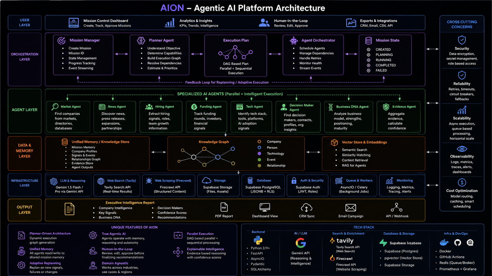

# AION – Automated Intelligence Operating Network

## Where Autonomous Intelligence Meets Enterprise Growth

AION is an Agentic AI Operating System that transforms a simple business objective into a fully autonomous enterprise discovery workflow. Instead of manually searching for companies, researching technologies, and prioritizing prospects, AION orchestrates multiple specialized AI agents that collaboratively discover, analyze, reason, and recommend the best business opportunities with explainable intelligence.

---
## Team

* **Team Name:** TriVenture
* **Members:**
    * Yamuna Latchipatruni
    * Rashmi Sharma
    * Dharani Alla

## Problem Statement

Enterprise B2B discovery is largely a manual and time-consuming process. Business development and sales teams spend significant time searching across multiple platforms, validating company information, understanding technology adoption, and deciding which organizations should be prioritized.

Traditional tools provide fragmented information, requiring users to manually combine data from search engines, company websites, professional networks, and market reports.

AION eliminates this fragmented workflow through an autonomous multi-agent system capable of planning, executing, reasoning, and generating actionable business intelligence.

---

## Solution

AION accepts a natural language business objective and autonomously executes an end-to-end enterprise discovery workflow. 

Instead of relying on a single AI model, AION coordinates multiple specialized AI agents that collaborate through a shared mission memory, producing structured business intelligence and explainable recommendations.

### Current Execution Pipeline

```text
Mission Creation
        │
        ▼
Strategy Agent
        │
        ▼
Planner Agent
        │
        ▼
Market Discovery Agent
        │
        ▼
Business DNA Agent
        │
        ▼
Recommendation Agent

```
---

## Key Features

* **Autonomous Multi-Agent Orchestration:** End-to-end pipeline automation without manual intervention.
* **Intelligent Strategy Generation:** Formulates business context and Ideal Customer Profiles (ICP) dynamically.
* **Dynamic Execution Planning:** Generates dependency-aware execution graphs.
* **Real-Time Company Discovery:** Deep web and site scraping integration.
* **Business DNA Profiling:** Automated extraction of technology maturity, strengths, risks, and use cases.
* **Explainable Recommendation Engine:** Weighted scoring and confidence rankings with supporting evidence.
* **Shared Mission Memory:** Centralized state management to minimize redundant API calls.
* **Modular Architecture:** Easily scalable repository design to append future agent types.
* **Mission Tracking:** Visual execution graphs and state persistence.
* **Persistent Storage:** Robust backend architecture utilizing Supabase.

---

## Architecture

The system architecture is detailed in the project root file `architecture.png`.



---

## Workflow

### 1. Mission Creation
The user defines a business objective using a conversational interface.
*Example:* "Find manufacturing companies in Germany adopting Artificial Intelligence."

### 2. Strategy Agent
Generates the core foundational parameters:
* Business Strategy
* Ideal Customer Profile (ICP)
* Mission Intelligence
* Business Context

### 3. Planner Agent
Transforms the strategy into an executable workflow by:
* Selecting required agents
* Creating an execution graph
* Defining execution order
* Managing dependencies

### 4. Market Discovery Agent
Leverages the Tavily Search API and Firecrawl API to aggregate:
* Company URLs
* Website Content
* Search Evidence
* Structured Business Information

### 5. Business DNA Agent
Converts discovered raw company data into structured intelligence by identifying:
* Industry and Company Type
* AI Maturity and Technology Signals
* Business Summary and Use Cases
* Strengths, Risks, and Supporting Evidence

### 6. Recommendation Engine
Ranks organizations based on multi-dimensional alignment matrices:
* ICP Alignment and Business Relevance
* Technology Fit
* Confidence Score
* Priority Ranking and Supporting Evidence

---

## Shared Mission Memory

Rather than allowing every agent to independently repeat the same extraction processes, AION maintains a centralized Shared Mission Memory. Each agent contributes its outputs, enabling downstream agents to reuse contextual intelligence while maintaining complete traceability.

```text
Mission ──> Strategy ──> Planner ──> Market Discovery ──> Business DNA ──> Recommendation
```

---

## Technology Stack

### Frontend
* Next.js
* React
* TypeScript
* Tailwind CSS

### Backend
* Python
* FastAPI
* AsyncIO
* Pydantic

### AI and Agent Intelligence
* Google Gemini API
* Tavily Search API
* Firecrawl API
* Multi-Agent Orchestration Frameworks

### Database and Storage
* Supabase PostgreSQL
* JSONB Schema Storage
* Mission Repository
* Agent Result Repository

---

## Project Structure

```text
AION
│
├── client/                     # Next.js frontend application
│
├── server/                     # FastAPI backend application
│   ├── agents/                 # Specialized agent implementations
│   ├── api/                    # API endpoints and routers
│   ├── orchestration/          # Agent coordination and memory logic
│   ├── repositories/           # Database access layer
│   ├── schemas/                # Pydantic validation models
│   ├── services/               # Core business logic
│   └── llm/                    # LLM configuration and prompt management
│
├── architecture.png            # Architecture diagram
├── README.md                   # Project documentation
└── .gitignore                  # Git ignore file

```
---

## Installation

### Clone Repository

```bash
git clone [https://github.com/](https://github.com/)<username>/<repository-name>.git
cd AION
```

### Frontend setup

```bash
cd client
npm install
npm run dev

```

### Backend setup

```bash
cd server
python -m venv .venv

```

#### Activate Virtual Environment

* **Windows:**
    ```bash
    .venv\Scripts\activate
    ```
* **macOS/Linux:**
    ```bash
    source .venv/bin/activate
    ```

#### Install Dependencies and Start Server

```bash
pip install -r requirements.txt
uvicorn app.main:app --reload

```

* **Backend API URL:** `http://localhost:8000`
* **Interactive Swagger Documentation:** `http://localhost:8000/docs`

---

## Environment Variables

Create a `.env` file inside the `server` directory and populate it with the following credentials:

```env
GOOGLE_API_KEY=your_google_api_key_here
TAVILY_API_KEY=your_tavily_api_key_here
FIRECRAWL_API_KEY=your_firecrawl_api_key_here
SUPABASE_URL=your_supabase_project_url_here
SUPABASE_KEY=your_supabase_anon_key_here

```

## Future Scope

* **Intelligence Expansions:** Hiring Intelligence Agent, Funding Intelligence Agent, and Competitor Intelligence systems.
* **Reporting:** Automated Executive Brief Generation and Compliance Validation modules.
* **Integrations:** Native LinkedIn MCP, Salesforce, and HubSpot connectors.
* **Advanced AI Engineering:** Knowledge Graph Reasoning structures and Digital Twin modules for continuous real-time market tracking.

---

## Vision

AION is more than a business discovery platform—it is an Agentic AI Operating System that enables autonomous enterprise intelligence. By combining dynamic planning, multi-layered reasoning, collaborative memory architectures, and explainable output criteria, AION transforms complex business objectives into clear, evidence-backed decisions with minimal human intervention.
